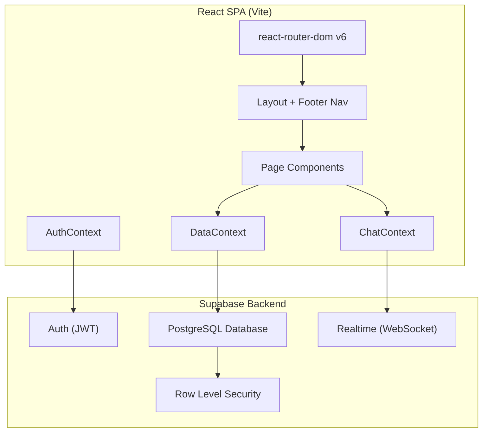
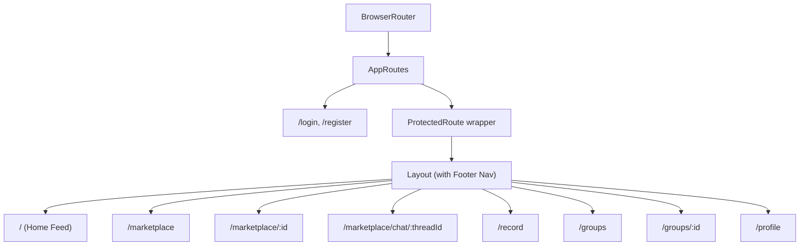
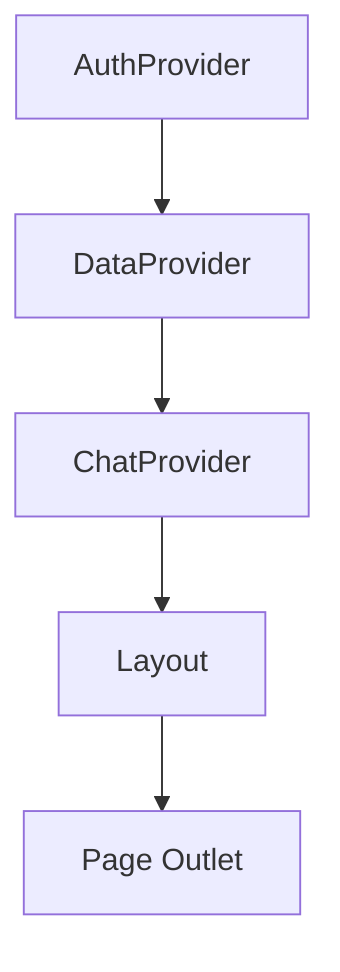

# Design Document: FitCarousell Overhaul

## Overview

This design overhauls FitCarousell from a fitness-tracking app with a community tab into a fitness-social-marketplace hybrid. The key structural changes are:

1. **Home Feed as default** — The "/" route becomes a scrollable activity feed with infinite scroll and interspersed merchant advertisements.
2. **New navigation structure** — A persistent 5-tab bottom nav (Home, Marketplace, Record, Groups, You) replaces the current header/mobile nav.
3. **Enhanced Marketplace** — Adds real-time chat between buyers/sellers, an offer/negotiation system, spotlight (paid promotion), and seller ratings.
4. **Groups** — Replaces the "Community" and "Events" pages with a unified Groups section supporting communities, merchant events, and fitness challenges.
5. **Record placeholder** — A stub page for future GPS tracking.
6. **Profile consolidation** — Retains existing profile functionality with activity stats.

The app continues to use React 18 + Vite, react-router-dom v6, Supabase (auth + database + Realtime), Context API for state, and plain CSS for styling.

## Architecture

### High-Level Architecture



### Routing Architecture



### State Management Architecture

The app uses React Context for global state, split into three providers:

1. **AuthContext** (existing) — user session, profile, auth operations
2. **DataContext** (extended) — activities, feed posts, listings, events, groups, follows
3. **ChatContext** (new) — real-time messaging, unread counts, Supabase Realtime subscriptions



## Components and Interfaces

### Component Hierarchy

```
App
├── AuthProvider
│   └── BrowserRouter
│       └── AppRoutes
│           ├── Login (public)
│           ├── Register (public)
│           └── ProtectedRoute
│               └── DataProvider
│                   └── ChatProvider
│                       └── Layout
│                           ├── <main> Outlet
│                           │   ├── HomeFeed
│                           │   │   ├── FeedCard
│                           │   │   │   ├── ActivityFeedCard
│                           │   │   │   └── AdFeedCard
│                           │   │   └── LoadingIndicator
│                           │   ├── Marketplace
│                           │   │   ├── SpotlightSection
│                           │   │   ├── ListingGrid
│                           │   │   │   └── ListingCard
│                           │   │   ├── ListingDetail
│                           │   │   ├── CreateListingForm
│                           │   │   └── SearchAndFilter
│                           │   ├── MarketplaceChat
│                           │   │   ├── ChatThreadList
│                           │   │   ├── ChatThread
│                           │   │   │   ├── MessageBubble
│                           │   │   │   └── OfferMessage
│                           │   │   └── ChatInput
│                           │   ├── Record (placeholder)
│                           │   ├── Groups
│                           │   │   ├── GroupList
│                           │   │   │   └── GroupCard
│                           │   │   └── GroupDetail
│                           │   │       ├── GroupFeed
│                           │   │       ├── GroupEvents
│                           │   │       └── GroupChallenges
│                           │   └── Profile
│                           │       ├── ProfileHeader
│                           │       ├── ActivityStats
│                           │       ├── SellerRatings
│                           │       └── MerchantDashboard
│                           └── FooterNav
```

### Key Component Interfaces

#### Layout (revised)

```jsx
// src/components/Layout.jsx
// Renders the main content area with <Outlet /> and the persistent FooterNav.
// No header nav on mobile — the footer is the primary navigation.
export default function Layout() {
  // Renders: <main> with Outlet + <FooterNav />
}
```

#### FooterNav

```jsx
// src/components/FooterNav.jsx
// Persistent bottom navigation bar, 5 tabs fixed order.
// Props: none (reads route via useLocation)
// Uses NavLink for active state styling.
const tabs = [
  { path: '/', label: 'Home', icon: '🏠' },
  { path: '/marketplace', label: 'Market', icon: '🛍️' },
  { path: '/record', label: 'Record', icon: '⏺️' },
  { path: '/groups', label: 'Groups', icon: '👥' },
  { path: '/profile', label: 'You', icon: '👤' },
]
```

#### HomeFeed

```jsx
// src/pages/HomeFeed.jsx
// Renders infinite-scroll feed of FeedCards.
// Loads 20 posts per batch. Intersperses ads at max 1:5 ratio.
// States: loading, error (with retry), empty state
```

#### ChatContext

```jsx
// src/context/ChatContext.jsx
// Manages real-time chat state via Supabase Realtime.
// Provides: threads, messages, unreadCounts, sendMessage, subscribeToThread
export function ChatProvider({ children }) {
  // Subscribes to `chat_messages` channel for real-time updates
  // Manages thread list and per-thread message arrays
}
```

#### Marketplace (enhanced)

```jsx
// src/pages/Marketplace.jsx
// Top: SpotlightSection (up to 6 spotlighted listings)
// Search bar + category filter buttons
// Grid of ListingCards
// Sub-routes: /marketplace/:id (detail), /marketplace/chat/:threadId
```

#### ListingDetail

```jsx
// src/pages/ListingDetail.jsx
// Full listing info + seller info + seller rating
// Buttons: "Chat with Seller", "Make Offer" (if not own listing)
// Button: "Spotlight" (if own listing and merchant)
```

## Data Models

### New Database Tables

The following tables extend the existing schema to support chat, offers, spotlight, ratings, groups, challenges, and advertisements.

#### chat_threads

```sql
create table public.chat_threads (
  id uuid default uuid_generate_v4() primary key,
  listing_id uuid references public.listings(id) on delete cascade not null,
  buyer_id uuid references public.profiles(id) on delete cascade not null,
  seller_id uuid references public.profiles(id) on delete cascade not null,
  created_at timestamptz default now(),
  updated_at timestamptz default now(),
  unique(listing_id, buyer_id)
);
```

#### chat_messages

```sql
create table public.chat_messages (
  id uuid default uuid_generate_v4() primary key,
  thread_id uuid references public.chat_threads(id) on delete cascade not null,
  sender_id uuid references public.profiles(id) on delete cascade not null,
  content text not null check (char_length(content) between 1 and 1000),
  message_type text not null default 'text' check (message_type in ('text', 'offer', 'offer_accepted', 'offer_declined', 'system')),
  read boolean default false,
  created_at timestamptz default now()
);
```

#### offers

```sql
create table public.offers (
  id uuid default uuid_generate_v4() primary key,
  listing_id uuid references public.listings(id) on delete cascade not null,
  buyer_id uuid references public.profiles(id) on delete cascade not null,
  amount numeric(10, 2) not null check (amount > 0),
  status text not null default 'pending' check (status in ('pending', 'accepted', 'declined')),
  created_at timestamptz default now()
);
```

#### listing_spotlights

```sql
create table public.listing_spotlights (
  id uuid default uuid_generate_v4() primary key,
  listing_id uuid references public.listings(id) on delete cascade not null unique,
  activated_at timestamptz default now(),
  expires_at timestamptz not null
);
```

#### seller_ratings

```sql
create table public.seller_ratings (
  id uuid default uuid_generate_v4() primary key,
  listing_id uuid references public.listings(id) on delete cascade not null,
  buyer_id uuid references public.profiles(id) on delete cascade not null,
  seller_id uuid references public.profiles(id) on delete cascade not null,
  score integer not null check (score between 1 and 5),
  review text check (char_length(review) <= 500),
  created_at timestamptz default now(),
  unique(listing_id, buyer_id)
);
```

#### groups

```sql
create table public.groups (
  id uuid default uuid_generate_v4() primary key,
  name text not null check (char_length(name) between 1 and 100),
  description text check (char_length(description) <= 200),
  created_by uuid references public.profiles(id) on delete set null,
  member_count integer default 0,
  created_at timestamptz default now()
);
```

#### group_members

```sql
create table public.group_members (
  id uuid default uuid_generate_v4() primary key,
  group_id uuid references public.groups(id) on delete cascade not null,
  user_id uuid references public.profiles(id) on delete cascade not null,
  joined_at timestamptz default now(),
  unique(group_id, user_id)
);
```

#### group_events

```sql
create table public.group_events (
  id uuid default uuid_generate_v4() primary key,
  group_id uuid references public.groups(id) on delete cascade not null,
  merchant_id uuid references public.profiles(id) on delete cascade not null,
  title text not null check (char_length(title) <= 100),
  description text check (char_length(description) <= 500),
  date date not null,
  time time,
  location text check (char_length(location) <= 200),
  created_at timestamptz default now()
);
```

#### challenges

```sql
create table public.challenges (
  id uuid default uuid_generate_v4() primary key,
  group_id uuid references public.groups(id) on delete cascade not null,
  created_by uuid references public.profiles(id) on delete set null,
  title text not null check (char_length(title) <= 100),
  goal text not null check (char_length(goal) <= 300),
  start_date date not null,
  end_date date not null,
  created_at timestamptz default now(),
  check (end_date > start_date)
);
```

#### advertisements

```sql
create table public.advertisements (
  id uuid default uuid_generate_v4() primary key,
  merchant_id uuid references public.profiles(id) on delete cascade not null,
  title text not null check (char_length(title) <= 100),
  image text not null,
  link_type text not null check (link_type in ('listing', 'event')),
  link_id uuid not null,
  is_active boolean default true,
  created_at timestamptz default now()
);
```

### Schema Modifications to Existing Tables

#### listings — add status and sold_to columns

```sql
alter table public.listings 
  add column status text not null default 'active' check (status in ('active', 'sold')),
  add column sold_to uuid references public.profiles(id);
```

### Realtime Configuration

Enable Supabase Realtime on `chat_messages` table for live message delivery:

```sql
alter publication supabase_realtime add table chat_messages;
```

### Key Indexes

```sql
create index idx_chat_threads_buyer on chat_threads(buyer_id);
create index idx_chat_threads_seller on chat_threads(seller_id);
create index idx_chat_threads_listing on chat_threads(listing_id);
create index idx_chat_messages_thread on chat_messages(thread_id, created_at);
create index idx_chat_messages_unread on chat_messages(thread_id, read) where read = false;
create index idx_offers_listing on offers(listing_id);
create index idx_offers_buyer on offers(buyer_id);
create index idx_spotlight_expires on listing_spotlights(expires_at);
create index idx_seller_ratings_seller on seller_ratings(seller_id);
create index idx_group_members_user on group_members(user_id);
create index idx_group_members_group on group_members(group_id);
create index idx_group_events_group on group_events(group_id);
create index idx_challenges_group on challenges(group_id);
create index idx_advertisements_merchant on advertisements(merchant_id);
create index idx_advertisements_active on advertisements(is_active) where is_active = true;
```


## Correctness Properties

*A property is a characteristic or behavior that should hold true across all valid executions of a system — essentially, a formal statement about what the system should do. Properties serve as the bridge between human-readable specifications and machine-verifiable correctness guarantees.*

### Property 1: Feed posts are in reverse chronological order

*For any* array of feed posts with distinct `created_at` timestamps, the Home Feed SHALL display them sorted in strictly descending order by `created_at`.

**Validates: Requirements 1.2**

### Property 2: Advertisement interspersing respects ratio constraints

*For any* set of organic feed cards and advertisements, the interspersed feed SHALL contain at most 1 advertisement per 5 consecutive organic feed cards, and SHALL contain zero advertisements if fewer than 5 organic feed cards are loaded.

**Validates: Requirements 1.3, 11.3**

### Property 3: Sub-route highlights correct parent tab

*For any* URL path that is a sub-route of a top-level navigation section (e.g., `/marketplace/chat/123` is under `/marketplace`), the Footer Nav SHALL mark the parent section's tab as active.

**Validates: Requirements 2.6**

### Property 4: Listing creation validation

*For any* listing input, creation SHALL succeed if and only if the title has 1–100 characters, the price is between 0.01 and 99999999.99, a category is selected from the allowed set, and a condition is selected from the allowed set. Otherwise, creation SHALL be rejected and the form state preserved.

**Validates: Requirements 3.2, 3.3**

### Property 5: Marketplace search returns correct subset

*For any* search query string and set of listings, the search results SHALL include all and only listings whose title contains the query as a case-insensitive substring.

**Validates: Requirements 3.6**

### Property 6: Marketplace category filter returns correct subset

*For any* category filter selection and set of listings, the filtered results SHALL include all and only listings matching the selected category, or all listings when "All" is selected.

**Validates: Requirements 3.7**

### Property 7: Chat thread creation is idempotent

*For any* (buyer_id, listing_id) pair, calling the open-or-create thread operation multiple times SHALL always return the same thread ID.

**Validates: Requirements 4.2**

### Property 8: Chat messages display in chronological order

*For any* set of messages in a chat thread with distinct `created_at` timestamps, messages SHALL be displayed in ascending order by `created_at`.

**Validates: Requirements 4.4**

### Property 9: Unread count equals unread messages

*For any* chat thread and user, the displayed unread count SHALL equal the number of messages in that thread where `sender_id` is not the user and `read` is false.

**Validates: Requirements 4.5**

### Property 10: Message content validation

*For any* string, message submission SHALL succeed if and only if the string length is between 1 and 1000 characters (inclusive). Empty strings and strings exceeding 1000 characters SHALL be rejected.

**Validates: Requirements 4.6**

### Property 11: Offer amount validation

*For any* listing with a given price and any offer amount, the offer SHALL be accepted if and only if the amount is between 0.01 and the listing price (inclusive). Offers on listings with status "sold" SHALL always be rejected regardless of amount.

**Validates: Requirements 5.2, 5.3**

### Property 12: Accepting an offer transitions listing and sibling offers

*For any* listing with N pending offers (N ≥ 1), when one offer is accepted, the listing status SHALL become "sold" AND all other pending offers on the same listing SHALL have status "declined".

**Validates: Requirements 5.5**

### Property 13: Spotlight ordering and expiry

*For any* set of listings where some have active (non-expired) spotlights, the marketplace view SHALL display all active-spotlighted listings before all non-spotlighted listings. The featured section SHALL contain at most 6 active-spotlighted listings ordered by `activated_at` descending. Listings with `expires_at` in the past SHALL not be treated as spotlighted.

**Validates: Requirements 6.3, 6.4, 6.5**

### Property 14: Seller rating validation

*For any* rating submission, the system SHALL accept if and only if the score is an integer between 1 and 5 (inclusive), the optional review is at most 500 characters, the buyer is not the seller, and no prior rating exists for the same (listing_id, buyer_id) pair.

**Validates: Requirements 7.2, 7.3, 7.4**

### Property 15: Average seller rating computation

*For any* non-empty set of ratings for a seller, the displayed average SHALL equal the arithmetic mean of all scores rounded to one decimal place, and the count SHALL equal the total number of ratings. For an empty set, the display SHALL show "No ratings yet".

**Validates: Requirements 7.5**

### Property 16: Seller ratings paginated in reverse chronological order

*For any* seller with more than 20 ratings, the first page SHALL return exactly 20 ratings sorted by `created_at` descending, and each subsequent page SHALL continue in the same order without duplicates.

**Validates: Requirements 7.6**

### Property 17: Group membership count consistency

*For any* group, joining SHALL increase `member_count` by exactly 1 and leaving SHALL decrease `member_count` by exactly 1. The `member_count` SHALL always equal the number of rows in `group_members` for that group.

**Validates: Requirements 9.2, 9.8**

### Property 18: Display name validation

*For any* string, display name update SHALL succeed if and only if the trimmed string has length between 2 and 50 and matches the pattern `[a-zA-Z0-9 ]+`. All other strings SHALL be rejected with an appropriate error message.

**Validates: Requirements 10.4, 10.5**

### Property 19: Activity statistics computation

*For any* set of user activities, the Profile page SHALL display: total distance = sum of all `distance` values, total duration = sum of all `duration` values (formatted as hours and minutes), activity count = number of activities.

**Validates: Requirements 10.9**

### Property 20: Advertisements with deleted entities are excluded

*For any* set of advertisements, the Home Feed SHALL exclude any advertisement whose `link_id` references a listing or event that no longer exists in the database.

**Validates: Requirements 11.5**

### Property 21: Listings sorted by creation date descending

*For any* set of marketplace listings with distinct `created_at` timestamps (excluding spotlight ordering), listings SHALL be displayed in descending order by `created_at`.

**Validates: Requirements 3.4**

## Error Handling

### Network Errors

| Scenario | Behavior |
|----------|----------|
| Home Feed fails to load | Display error message with "Retry" button; retry re-fetches the failed batch |
| Infinite scroll batch fails | Show inline error below existing content with retry; preserve loaded posts |
| Chat message fails to send | Mark message with error indicator; show "Retry" option on the message |
| Listing creation fails | Show toast error; preserve form data so user doesn't lose input |
| Offer submission fails | Show error message; keep offer form open with entered amount |
| Rating submission fails | Show error toast; preserve form data |
| Profile update fails | Show inline error below form; retain edited input |

### Validation Errors

| Input | Constraint | Error Response |
|-------|-----------|----------------|
| Listing title | 1–100 characters, required | "Title is required" / "Title must be under 100 characters" |
| Listing price | 0.01–99999999.99 | "Price must be greater than zero" |
| Chat message | 1–1000 characters | "Message cannot be empty" / "Message exceeds 1000 characters" |
| Offer amount | 0.01–listing price | "Offer must be between $0.01 and $[price]" |
| Rating score | 1–5 integer | "Please select a rating between 1 and 5" |
| Rating review | 0–500 characters | "Review must be under 500 characters" |
| Display name | 2–50 chars, alphanumeric + spaces | "Display name must be 2-50 characters" / "Only letters, numbers, and spaces allowed" |

### Real-time Connection Handling

- **Supabase Realtime disconnect**: Attempt automatic reconnection with exponential backoff (1s, 2s, 4s, max 30s). Show a "Reconnecting..." banner in chat views after 3 seconds of disconnection.
- **Realtime reconnect success**: Fetch missed messages since last received timestamp to ensure no gaps.
- **Permanent failure (>60s disconnected)**: Show "Connection lost. Please refresh." message.

### Edge Cases

- **Concurrent offer acceptance**: Use database transactions. The first `accept` that sets `status = 'sold'` wins. Subsequent accept attempts fail gracefully with "Listing already sold".
- **Spotlight expiry during session**: Client checks `expires_at` against current time on each render. Expired spotlights are filtered out client-side. Background job (Supabase edge function or cron) cleans expired records.
- **Deleted listing while in chat**: Chat thread remains accessible for history, but "Make Offer" and "Buy" actions are disabled. Show "This listing is no longer available" banner.

## Testing Strategy

### Unit Tests (Example-Based)

Unit tests cover specific scenarios, UI rendering, and edge cases:

- **Routing**: Verify all routes render correct components; auth guards redirect properly
- **FooterNav**: Verify 5 tabs in correct order, active state styling, presence on authenticated pages only
- **Record page**: Static content renders correctly
- **Listing detail**: Conditional button rendering (Chat/Offer for non-owners, Spotlight for merchant owners)
- **Error states**: Error messages render for failed loads, failed sends, validation failures
- **Empty states**: Empty feed, no listings found, no ratings yet
- **Profile**: Displays correct stats, edit form toggles, logout works

### Property-Based Tests

Property-based tests validate universal invariants across many generated inputs. The project will use **fast-check** as the PBT library (JavaScript, works with Vite's test runner).

**Configuration:**
- Minimum 100 iterations per property test
- Each test tagged with: `Feature: fitcarousell-overhaul, Property {N}: {description}`

**Property tests to implement:**

1. Feed chronological ordering (Property 1)
2. Ad interspersing ratio (Property 2)
3. Sub-route to parent tab mapping (Property 3)
4. Listing validation (Property 4)
5. Marketplace search (Property 5)
6. Marketplace category filter (Property 6)
7. Chat thread idempotency (Property 7)
8. Message ordering (Property 8)
9. Unread count (Property 9)
10. Message validation (Property 10)
11. Offer amount validation (Property 11)
12. Accept offer state transition (Property 12)
13. Spotlight ordering and expiry (Property 13)
14. Rating validation (Property 14)
15. Average rating computation (Property 15)
16. Rating pagination ordering (Property 16)
17. Group membership count (Property 17)
18. Display name validation (Property 18)
19. Activity stats computation (Property 19)
20. Ads with deleted entities excluded (Property 20)
21. Listings sorted by created_at (Property 21)

### Integration Tests

- **Supabase Realtime**: Verify message delivery within 3 seconds
- **Auth flow**: Login → redirect to "/"; Logout → redirect to "/login"
- **Offer acceptance transaction**: Concurrent accepts result in only one success
- **RLS policies**: Verify sellers can't see other sellers' chat threads; users can only rate completed transactions

### Test Runner

Use **Vitest** (already compatible with Vite) with `@testing-library/react` for component tests and `fast-check` for property-based tests.

```bash
npm install -D vitest @testing-library/react @testing-library/jest-dom jsdom fast-check
```
