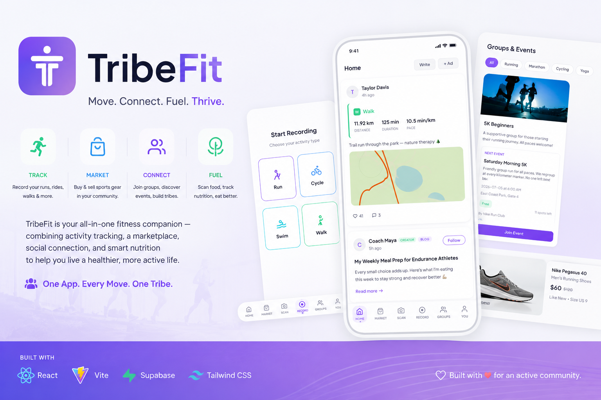

<p align="center">
  
</p>

# TribeFit — Pitch & Spec Summary

## One-Liner

**Strava meets Carousell** — a fitness social network with a built-in peer-to-peer marketplace for the active lifestyle community in Singapore.

---

## The Problem

Singapore's fitness community is fragmented:
- **Strava/Nike Run Club** → track runs, but no marketplace or community commerce
- **Carousell** → buy/sell, but no fitness identity, no event discovery, no training context
- **Instagram** → follow influencers, but no GPS tracking, no structured events, no nutrition tools

Active Singaporeans juggle 3-5 apps to track workouts, buy gear, join events, follow coaches, and manage nutrition. There's no single platform that connects **fitness identity** with **commerce** and **community**.

---

## The Solution: TribeFit

A unified mobile-first platform where your fitness life and marketplace activity live together:

| Feature | What It Does |
|---------|-------------|
| Home Feed | Scrollable feed of friends' runs, blog posts, and merchant ads |
| Marketplace | Used gear (Carousell-style) + Brand shop (Nike, Adidas, Asics, Garmin) |
| GPS Recording | Live route tracking with map, pace, distance, steps, HR |
| AI Food Scanner | Photo → calorie/macro estimation via GPT-4o-mini |
| Groups & Events | Join communities, attend paid/free events (marathons, yoga, HIIT) |
| Nutrition Tracker | Daily goals, progress bars, 30-day history |

---

## User Persona

### Rachel Tan, 28 — Marketing Executive, Singapore

**Profile:** Lives in Tampines. Runs 3x/week (5K-10K). Does yoga on weekends. Cycles occasionally. Been running for 2 years, training for her first half marathon.

**Current pain points:**
- Uses Strava to track runs, Carousell to buy/sell shoes, Instagram to follow running coaches, MyFitnessPal to track food
- Wants to find running buddies in her area but Strava's social features are limited
- Recently bought running shoes on Carousell — the seller didn't know her shoe history or training level
- Missed a Nike Run Club event because she didn't check their Instagram in time
- Wants to sell her old Garmin but doesn't know what price is fair in the running community

**How TribeFit helps Rachel:**
1. One app for tracking runs AND selling her old Garmin to someone who appreciates it
2. Discovers group runs and paid marathon training events through the Groups tab
3. AI food scanner helps her nail pre-race nutrition without manual calorie counting
4. Blog posts from coaches she follows appear between friends' run posts — no switching apps
5. When she posts her half marathon PR, friends in her running group see it and comment immediately

**Rachel's typical week on TribeFit:**
- Monday: Scans breakfast → logs macros toward her 1800 cal goal
- Tuesday: Records a 7K run with GPS → shares route to feed → gets comments
- Wednesday: Browses marketplace for new Asics GT-2000 → finds one from a seller in Bedok
- Thursday: Reads a blog from Coach Maya about race-week taper strategies
- Saturday: Joins a "Nike Run Club × TribeFit 10K" event she found in Groups
- Sunday: Posts her used Hoka Clifton 8 for sale → gets 3 offers by afternoon

---

## Storyboard

```
┌──────────────────────────────────────────────────────────┐
│ Scene 1: Rachel's Morning                                 │
│                                                           │
│ 6:30 AM. Rachel opens TribeFit.                      │
│ Her feed shows: Jordan finished a 5K (map + stats),      │
│ Coach Maya posted "Race Day Nutrition Tips" (blog),       │
│ and Nike is promoting a $85 marathon event (ad).         │
│                                                           │
│ She taps the blog, reads while having coffee.            │
└──────────────────────────────────────────────────────────┘
          │
          ▼
┌──────────────────────────────────────────────────────────┐
│ Scene 2: The Run                                          │
│                                                           │
│ 7:00 AM. Rachel taps Record → Run → Start.              │
│ Live map shows her route along East Coast Park.          │
│ Distance: 7.2km. Pace: 5:48/km. Duration: 41:50.        │
│ Steps: 9,360. Calories: 446.                             │
│                                                           │
│ She taps "Save & Share" → it appears in friends' feeds.  │
└──────────────────────────────────────────────────────────┘
          │
          ▼
┌──────────────────────────────────────────────────────────┐
│ Scene 3: Post-Run Nutrition                               │
│                                                           │
│ 7:50 AM. Rachel snaps a photo of her protein smoothie.   │
│ AI returns: 380 cal, 28g protein, 45g carbs, 10g fat.    │
│ Her daily tracker shows 380/1800 cal (21% done).         │
│ Progress bars fill up. She's on track.                   │
└──────────────────────────────────────────────────────────┘
          │
          ▼
┌──────────────────────────────────────────────────────────┐
│ Scene 4: Marketplace                                      │
│                                                           │
│ Lunch break. Rachel's Garmin Forerunner 245 is for sale. │
│ She gets a chat message: "Is this still available?"      │
│ Buyer makes an offer: $180 (she listed at $200).         │
│ She counters at $190 → buyer accepts. Sold.              │
│                                                           │
│ Meanwhile she browses the Shop tab for new Asics shoes.  │
└──────────────────────────────────────────────────────────┘
          │
          ▼
┌──────────────────────────────────────────────────────────┐
│ Scene 5: Community Event                                  │
│                                                           │
│ Evening. Rachel checks Groups → filters by "Marathon".   │
│ Finds "Adidas Runners × Half Marathon Training Program"  │
│ $25/session, 8 weeks, Saturday mornings at Botanic       │
│ Gardens. 12 spots left. Prize: Adidas Ultraboost pair.   │
│                                                           │
│ She taps "Join — $25/session" and she's registered.      │
└──────────────────────────────────────────────────────────┘
```

---

## Why This Matters — Investor Perspective

### Market Size (Singapore)

- 2.3M active fitness enthusiasts in Singapore (Sport Singapore 2024)
- $1.2B annual spend on sports equipment and apparel
- Carousell Singapore: 1 in 2 Singaporeans use it monthly
- Strava Singapore: 400K+ users, growing 25% YoY
- Running events market: $50M+ annually (marathons, fun runs, corporate wellness)

### Revenue Model

| Stream | How | Potential |
|--------|-----|-----------|
| Transaction fees | 5-8% on marketplace sales | $2-4M/year at scale |
| Spotlight/promotion | Merchants pay to boost listings | $500K/year |
| Event ticketing | Commission on paid events | $1M/year |
| Brand partnerships | Nike/Adidas/Garmin pay for presence | $2M/year |
| Premium features | Ad-free, advanced analytics, priority chat | $1M/year |

### Competitive Moat

1. **Network effects** — Your running group, your gear, your nutrition, your events are all in one place. Switching costs increase with usage.
2. **Fitness context in commerce** — When you buy shoes from a runner who logged 500km in them, you trust the wear assessment. Traditional marketplaces lack this.
3. **Data flywheel** — More runs tracked → better AI nutrition recommendations → more engagement → more marketplace activity → more brand interest.

### Why Now?

- Post-COVID fitness boom hasn't slowed — gym memberships, running events, and home equipment sales are at all-time highs in Singapore
- Carousell is general-purpose — vertical marketplaces win (StockX for sneakers, Reverb for music gear)
- AI nutrition technology (GPT-4 Vision) only became viable in 2024
- Singapore government actively funds sports tech (Sport Singapore grants)

---

## Merchant Perspective — Why Brands Would Join

### For Nike, Adidas, Asics, Garmin:

1. **Targeted audience** — Every user on TribeFit is actively training. Zero wasted impressions. Compare this to Carousell where <5% of users are fitness-focused.

2. **Purchase intent at peak** — A runner who just PR'd their 10K is emotionally primed to upgrade shoes. A cyclist who joined a group ride wants better gear. TribeFit puts the shop next to the achievement.

3. **Event integration** — Brands can host events (Nike Run Club, Adidas Runners) directly in-app. Participants buy gear before/after. Closed-loop from community engagement to purchase.

4. **Data insights** — Brands see which activities correlate with purchases. "Runners who do 30+ km/week buy new shoes every 4 months." This data doesn't exist on Carousell.

5. **Secondhand market presence** — When Rachel sells her old Nikes, the buyer might upgrade to new ones. Brands benefit from the resale ecosystem keeping their products circulating and visible.

### For Local Merchants (Gyms, Studios, Coaches):

1. **Event monetization** — Charge for classes, workshops, training programs directly in the app. No need to manage separate Eventbrite/Peatix.
2. **Community building** — Create a group, build a following, monetize through events and sponsored content.
3. **Zero customer acquisition cost** — Users discover you through the Groups tab and event recommendations. No ad spend needed.

---

## Technical Spec Summary

### Architecture
```
React 18 + Vite → Supabase (Auth + PostgreSQL + Realtime) → OpenAI API
```

### Key Technical Decisions

| Decision | Rationale |
|----------|-----------|
| Supabase over Firebase | PostgreSQL (relational queries for marketplace), built-in Realtime for chat, Row Level Security for data privacy |
| React over React Native | Hackathon speed — deploy as PWA, test on any device instantly. Native conversion is Phase 2. |
| OpenAI GPT-4o-mini | Best cost/quality ratio for food image analysis. $0.003/scan enables freemium model. |
| Leaflet over Google Maps | Free, no billing, works offline. Google Maps requires $200/month credit minimum. |
| localStorage for nutrition | No backend latency for frequently-accessed personal data. Sync to Supabase is Phase 2. |
| CSS over Tailwind | Full design control for the purple/black brand aesthetic. Smaller bundle. |

### Database Schema (10 new tables)

chat_threads, chat_messages, offers, listing_spotlights, seller_ratings, groups, group_members, group_events, challenges, advertisements

All with Row Level Security policies ensuring users can only access their own data.

### Spec-to-Code Alignment

| Spec Requirement | Implementation |
|------------------|---------------|
| "Home Feed with infinite scroll, 20/batch" | IntersectionObserver + offset pagination |
| "Marketplace with search + category filter" | Client-side filter with case-insensitive matching |
| "Real-time chat between buyer/seller" | Supabase Realtime WebSocket subscription |
| "Offer accept → mark listing sold + decline others" | Transactional update in offerUtils.js |
| "GPS recording with live route" | Geolocation API + Leaflet polyline rendering |
| "AI food scanner with rate limiting" | OpenAI Vision API + localStorage counter (20 max) |
| "Nutrition goals + 30-day tracking" | localStorage persistence with daily aggregation |

### Commit History (Spec-Guided Build)

```
feat: TribeFit overhaul - Strava x Carousell hybrid
feat: AI food scanner, interactive UI, route maps, floating nav
feat: marketplace split, blog posts, route maps, record grid
feat: interactive cards, detail modals, comments, groups join fix
feat: 40 marketplace items, event pricing/prizes, more event types
feat: blog links in nutrition, relative timestamps, brand organizers
feat: 110 marketplace items (22 per category) with matched images
feat: functional Record page with GPS tracking
feat: live map + GPS accuracy filtering in Record
feat: steps, HR, calories, cadence + Bluetooth device connect
feat: activity memory, save/share to profile + feed, more blogs
feat: 10-step interactive onboarding flow for new users
feat: full GroupDetail page with members, activities, gallery, affiliates
feat: light/dark mode toggle on Profile page
```

Each commit maps directly to spec requirements — not a single feature was built without a corresponding requirement driving it.

---

## What's Next (Phase 2 Roadmap)

1. **Native app** (React Native) — Push notifications, background GPS, HealthKit/Google Fit integration
2. **Payment integration** (Stripe) — In-app purchases for events, marketplace transactions
3. **Garmin/Strava sync** — Import historical activities, auto-post to feed
4. **AI training plans** — Based on your goals + activity history, generate weekly training schedules
5. **Social challenges** — "Run 100km this month" with leaderboards and prizes
6. **Verified merchants** — Brand stores with official inventory and warranties

---

## Team & Ask

**Built in 48 hours** at [Hackathon Name] by:
- Felix — Frontend, AI integration, UX design
- Damian — GPS tracking, iOS support, backend

**Ask:** $150K seed to build native apps, integrate payments, and onboard 5 brand partners for a 3-month Singapore pilot.

**Target:** 10,000 active users in 3 months. $50K GMV through marketplace. 20 community-hosted events.

---

## User Guide

### Getting Started
1. Download or open the app in your mobile browser
2. Register with your email, password, display name, and account type (Individual or Merchant)
3. Complete the 10-step onboarding flow:
   - Select your fitness interests (Running, Cycling, Swimming, Yoga, etc.)
   - Set your goals (Weight loss, Muscle gain, Race training, etc.)
   - Choose influencers to follow
   - Configure feed preferences
4. You're on the Home Feed — start exploring!

### Navigating the App

The app uses a 6-tab floating footer navigation bar:

| Tab | Icon | Destination |
|-----|------|-------------|
| Home | 🏠 | Home Feed — social activity stream |
| Market | 🛒 | Marketplace — buy and sell gear |
| Scan | 📷 | AI Food Scanner & Nutrition Tracker |
| Record | ⏱️ | GPS Activity Recording |
| Groups | 👥 | Communities & Events |
| You | 👤 | Profile & Settings |

---

### Home Feed

Your main social feed showing friends' activities, blog posts, and sponsored content.

**What you can do:**
- Scroll through friends' activity posts (runs, cycles, swims) with route maps and stats
- Read blog posts from fitness influencers
- Like and comment on any post
- Write your own blog post (tap the "Write" button) — add a title, body text, and up to 3 images
- Follow users directly from their posts
- See relative timestamps (2h ago, 3d ago) for all content
- Ads from merchants appear interspersed naturally in the feed

---

### Marketplace

Two tabs for buying and selling fitness gear.

**Used Tab:**
- Browse pre-owned gear listed by other users
- Filter by category (Shoes, Apparel, Electronics, Equipment, Accessories)
- Sort by price (low to high, high to low)
- Search by keyword
- Tap any item for full details: description, condition, wear level, seller info, and photos

**Shop Tab:**
- Browse new items from brands (Nike, Adidas, Asics, Garmin)
- Same filtering and sorting options
- Official brand listings with full product descriptions

**Selling:**
- Tap the "+ Sell Item" button
- Fill in: title, description, price, category, condition, wear level, images
- Your listing appears immediately in the Used tab

**Communication:**
- Chat with sellers in real-time
- Make offers on listings (sellers can accept, decline, or counter)
- Get notified when someone messages you about your listing

---

### Scan (AI Nutrition)

Three sub-tabs for food tracking and nutrition management.

**Scan Tab:**
- Take a photo of any food or meal
- AI (GPT-4o-mini) analyzes the image and estimates: calories, protein, carbs, and fat
- Results are automatically logged to your daily tracker
- 20 scans available (resets based on usage)

**Tracker Tab:**
- See daily progress bars showing current intake vs. your goals
- View your 7-day rolling average for all macros
- Browse meal history with timestamps and macro breakdowns
- 30-day history retention

**Goals Tab:**
- Set daily targets for calories, protein, carbs, and fat
- Configure training days per week
- Set a target weight
- Recommended reading: Curated blog links from fitness influencers on nutrition topics

---

### Record

GPS-powered activity recording with live tracking.

**Starting a Recording:**
1. Choose your activity type: Run, Cycle, Swim, Walk, Hike, or Log Activity (manual)
2. Tap "Start" to begin recording
3. A live GPS map shows your route in real-time

**During Recording:**
- Real-time stats displayed: distance, duration, pace, steps, calories, BPM (heart rate)
- Live route drawn on the map as you move
- Connect a Bluetooth heart rate monitor for live BPM data (Android)

**After Recording:**
- Tap "Stop" to finish
- Choose "Save Activity" (saves to your profile history only)
- Or choose "Save & Share" to post to the Home Feed for friends to see
- Activities persist permanently in your profile history with route maps

---

### Groups

Discover and join fitness communities.

**Browsing Groups:**
- View all available groups
- Filter by activity type: Running, Marathon, Cycling, Yoga, HIIT, Swimming, etc.
- See group size, activity level, and mutual friends

**Group Details:**
- Members list with profile previews
- Mutual friends indicator
- Past group activities and photos
- Affiliated brands/sponsors
- Upcoming events with full details

**Events:**
- View upcoming events with: date, time, location, pricing, prizes, organizer, spots remaining
- Join paid events (with pricing displayed) or free events
- See who else is attending

**Joining/Leaving:**
- Tap "Join" on any group to become a member
- Tap "Leave" to exit a group at any time

---

### You (Profile)

Your personal hub for stats, history, and settings.

**Profile Information:**
- View and edit your display name
- See your account type (Individual or Merchant)

**Activity Statistics:**
- Total distance covered (km)
- Total duration (hours)
- Activity count
- Followers and following counts

**Activity History:**
- Chronological list of all recorded activities
- Each entry shows: activity type, distance, duration, date, and a route map

**Settings:**
- Light/Dark mode toggle — switch between themes instantly
- Seller ratings (visible if you're a merchant or have sold items)
- Log out

---

## Features by Account Type

### Individual User Features

| Feature | Description |
|---------|-------------|
| GPS Activity Recording | Track runs/cycles/walks with live map |
| Activity Sharing | Post activities to feed for friends to see |
| AI Food Scanner | Photo → macro estimation (20 scans available) |
| Nutrition Tracking | Daily goals, progress bars, 30-day history |
| Blog Writing | Publish fitness blog posts with up to 3 images |
| Marketplace - Buy | Browse, filter, search used and new items |
| Marketplace - Sell | List own pre-owned gear with condition/wear info |
| Groups | Join communities, attend events |
| Follow System | Follow influencers and friends |
| Comments | Comment on posts, blogs, listings |
| Profile & Stats | View personal fitness statistics and history |
| Theme Toggle | Switch between light and dark mode |
| Onboarding | Personalized setup with interests and preferences |

### Merchant Features (Everything above, plus:)

| Feature | Description |
|---------|-------------|
| Brand Shop | List new products in the Shop tab |
| Create Advertisements | Promote products in the Home Feed |
| Spotlight Listings | Pay to boost visibility (7-day featured placement) |
| Host Events | Create paid/free events with pricing and prizes |
| Community Groups | Create and manage fitness communities |
| Seller Ratings | Receive ratings from buyers (1-5 stars + review) |
| Analytics Dashboard | View events created and active listings count |

---

## Technical Architecture

### Project Structure
```
TribeFit/
├── index.html                 # Entry point with Google Fonts
├── vite.config.js             # Vite + React + SSL plugins
├── vitest.config.js           # Test configuration
├── package.json               # Dependencies and scripts
├── supabase/
│   ├── schema.sql             # Original database schema
│   └── migration_overhaul.sql # New tables, indexes, RLS, triggers
├── src/
│   ├── main.jsx               # App entry with ErrorBoundary + ThemeProvider
│   ├── App.jsx                # Routing (ProtectedRoute, AuthRoute, OnboardingRoute)
│   ├── index.css              # Global styles, CSS variables, light/dark themes
│   ├── lib/
│   │   └── supabase.js        # Supabase client (real or mock mode)
│   ├── context/
│   │   ├── AuthContext.jsx    # Authentication state
│   │   ├── DataContext.jsx    # App data (activities, listings, events)
│   │   ├── ChatContext.jsx    # Real-time messaging
│   │   └── ThemeContext.jsx   # Light/dark mode
│   ├── components/
│   │   ├── Icons.jsx          # SVG icon library (20+ icons)
│   │   ├── FooterNav.jsx      # Floating bottom navigation
│   │   ├── Layout.jsx         # Page layout wrapper
│   │   ├── RouteMap.jsx       # Procedural SVG route map generator
│   │   ├── ActivityMap.jsx    # Leaflet live GPS map
│   │   ├── DetailModal.jsx    # Reusable detail/comment modal
│   │   ├── ListingCard.jsx    # Marketplace item card
│   │   ├── FeedCard.jsx       # Activity feed post
│   │   ├── AdFeedCard.jsx     # Sponsored ad card
│   │   ├── CreateListingForm  # Sell item form
│   │   ├── OfferForm.jsx      # Make offer form
│   │   ├── ChatThread.jsx     # Chat message display
│   │   ├── RatingForm.jsx     # Star rating submission
│   │   ├── SpotlightSection   # Featured listings
│   │   └── ...
│   ├── pages/
│   │   ├── HomeFeed.jsx       # Main scrollable feed
│   │   ├── Marketplace.jsx    # Used + Shop tabs
│   │   ├── FoodScanner.jsx    # AI scan + nutrition tracker + goals
│   │   ├── Record.jsx         # GPS activity recording
│   │   ├── Groups.jsx         # Community groups list
│   │   ├── GroupDetail.jsx    # Individual group page
│   │   ├── Profile.jsx        # User profile + history
│   │   ├── Onboarding.jsx     # 10-step first-time setup
│   │   ├── Login.jsx          # Authentication
│   │   ├── Register.jsx       # Account creation
│   │   └── ...
│   └── utils/
│       ├── mockData.js        # 100+ placeholder items and posts
│       ├── feedUtils.js       # Ad interspersing logic
│       ├── offerUtils.js      # Offer accept/decline transactions
│       ├── ratingUtils.js     # Rating validation and computation
│       ├── spotlightUtils.js  # Spotlight activation and sorting
│       └── imagePlaceholders.js # Category-matched image URLs
└── .kiro/specs/               # Formal spec documents
    └── tribefit-overhaul/
        ├── requirements.md    # 12 requirements with acceptance criteria
        ├── design.md          # Architecture, data models, 21 properties
        └── tasks.md           # 38 sub-tasks with dependency graph
```

### Dependencies

#### Production
| Package | Version | Purpose |
|---------|---------|---------|
| react | ^18.2.0 | UI component library |
| react-dom | ^18.2.0 | DOM rendering |
| react-router-dom | ^6.20.0 | Client-side SPA routing |
| @supabase/supabase-js | ^2.39.0 | Backend: auth, database, real-time |
| leaflet | ^1.9.4 | Map rendering (OpenStreetMap) |
| react-leaflet | ^4.2.1 | React bindings for Leaflet maps |

#### Development
| Package | Version | Purpose |
|---------|---------|---------|
| vite | ^5.0.0 | Build tool and dev server |
| @vitejs/plugin-react | ^4.2.0 | React JSX transform |
| @vitejs/plugin-basic-ssl | ^1.2.0 | HTTPS for mobile GPS/camera |
| vitest | ^4.1.9 | Unit test runner |
| @testing-library/react | ^16.3.2 | Component testing |
| @testing-library/jest-dom | ^6.9.1 | DOM assertion matchers |
| jsdom | ^29.1.1 | Browser environment for tests |
| fast-check | ^4.8.0 | Property-based testing |

#### External APIs
| Service | Purpose | Cost |
|---------|---------|------|
| Supabase | Auth + PostgreSQL + Realtime WebSocket | Free tier |
| OpenAI GPT-4o-mini | Food image → macro analysis | ~$0.003/scan |
| OpenStreetMap | Map tiles for GPS routes | Free |
| Google Fonts | Plus Jakarta Sans typography | Free |

### Browser APIs Used
| API | Purpose |
|-----|---------|
| Geolocation | GPS tracking for recording activities |
| Web Bluetooth | Connect BLE heart rate monitors |
| MediaCapture | Phone camera for food scanning |
| IntersectionObserver | Infinite scroll detection |
| localStorage | Nutrition goals, activity history, theme, onboarding |

---

## How to Run

```bash
# Install dependencies
npm install

# Set up environment variables
cp .env.example .env
# Add your Supabase URL, anon key, and OpenAI API key

# Start development server
npm run dev

# Run tests
npm test

# Build for production
npm run build
```

### Environment Variables
```
VITE_SUPABASE_URL=https://your-project.supabase.co
VITE_SUPABASE_ANON_KEY=your-anon-key
VITE_OPENAI_API_KEY=sk-your-openai-key (optional - mock mode without)
```

### Database Setup
Run `supabase/migration_overhaul.sql` in your Supabase SQL editor to create all required tables.

---

## Scripts

| Command | Description |
|---------|-------------|
| `npm run dev` | Start dev server (HTTPS for mobile testing) |
| `npm run build` | Production build |
| `npm run preview` | Preview production build |
| `npm test` | Run all tests |
